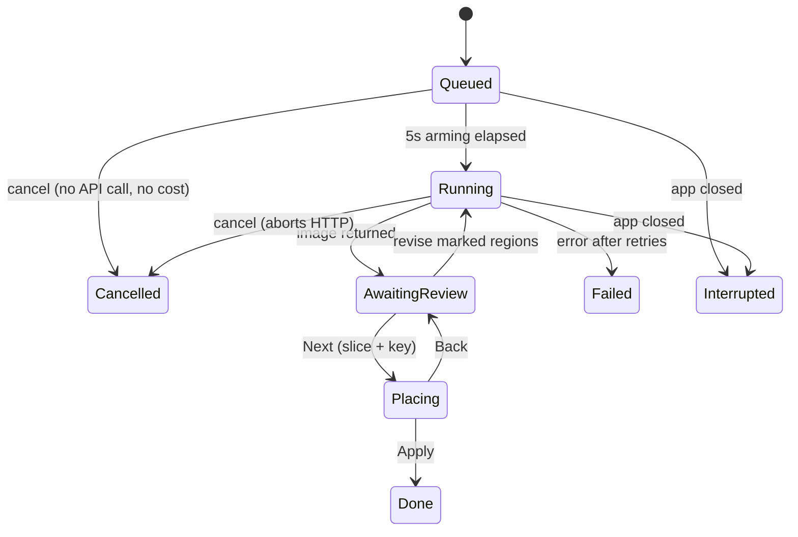

# Architecture

How the pieces fit together and how data moves through them. For project status,
conventions and open questions see [CONTEXT.md](CONTEXT.md).

## Layering

```
┌─────────────────────────────────────────────────────────────┐
│  Browser                                                     │
│    wwwroot/js/interop.js      ← ALL pixel work + FS Access   │
│           ▲ JSInterop (small payloads only)                  │
├───────────┼─────────────────────────────────────────────────┤
│  TextureStudio.App (Blazor WASM)                             │
│    Pages/*.razor              ← UI, no domain logic          │
│    Services/StudioState.cs    ← the single app state object  │
│    Services/ImageCodec.cs     ← typed wrapper over interop   │
│    Services/WorkspaceService  ← workspace handle (readwrite) │
│    Services/ContentSearchSvc  ← search handle (read-only)    │
├─────────────────────────────────────────────────────────────┤
│  TextureStudio.Core (pure, no UI, no JS)                     │
│    Games/     IGame · IGameArchive · IGameMetadata           │
│               IGameLocator · IDirectoryTree · PackPlan       │
│               GameEdition · GameCatalog                      │
│      BlakeStone/  VSWAP archive, VGA palette, sprite table,  │
│                   installed-copy locator                     │
│    Formats/   VSWAP container + tile codecs (shared)         │
│    Imaging/   compose · slice · key · placement · darken     │
│    Generation/ model clients, revision tools                 │
│    Model/     Project + everything persisted                 │
└─────────────────────────────────────────────────────────────┘
        ▲                                   ▲
   TextureStudio.Pack                 TextureStudio.Rekey
   (workspace → mod dir)          (re-slice archived sheets)
```

Dependencies point inward only: Core knows nothing about Blazor, JS, or the
workspace. The two CLIs reuse Core directly, which is why pack/re-slice logic
never has to be duplicated for the browser.

## The game layer

Everything a *source game* dictates sits behind `Games/IGame`; everything after
the tiles are decoded is game-agnostic. One workspace targets one game
(`Project.GameId`) and one edition (`Project.EditionId`, empty = detect).

| Concern | Interface member | Blake Stone |
| --- | --- | --- |
| Asset container | `OpenArchive` → `IGameArchive` | `VswapArchive` over `VswapFile` + `TileDecoders` + `BlakeStonePalette` |
| Tile identity | `IGameArchive.Tiles` (`GameTile`), `KindOf` | `w22` walls (Full), `s53` sprites (Cutout) |
| Workspace file names | `WorkspaceFileName` | `w12` → `wall_00012.png` |
| Which release | `Editions`, `DetectEdition` | extension: `.BS6` full, `.BS1` shareware, `.VSI` Planet Strike |
| Import UI | `ImportAccept`, `ImportHint` | `.BS6,.BS1,.VSI` |
| Light/dark convention | `DefaultLightSource`, `AutoPairRole`, `AutoPairCategory`, `AutoPairDescription` | odd wall ← even sibling |
| Pack contents | `PlanPack(project, edition, redrawKeys)` → `PackPlan` | `aog/wall_00000012.png`, darks synthesized |
| Install steps | `InstallGuide` | links to BStone + its addon and external-texture docs |
| Engine reference data | `Metadata` → `IGameMetadata` | `canonical-sprites.json`, `SPR_*` constant parsing |
| Finding installed copies | `Locator` → `IGameLocator` | bounded walk for `AUDIOHED.*` markers, `VSWAP.*` art |

### Tile identity and tile kind

These are separate on purpose, because they answer different questions.

**Identity** is an opaque short string the game mints — `w22`, `s53`. Nothing
outside the plugin parses it; the app carries it as a key and asks the game
whenever it needs to know anything. That is what lets `w`/`s` stay a naming
convenience rather than a concept the pipeline understands.

**Kind** (`TileKind`) is the *only* tile distinction the pipelines may make:

| Kind | Meaning | Pipeline treatment |
| --- | --- | --- |
| `Full` | fills its cell, opaque | composed flush, resampled to the target square exactly, never keyed or placed |
| `Cutout` | an object with transparency around it | composed inset over matte, content-box detected, alpha keyed, hand-placed |

Add a kind only when some stage would otherwise have to ask *which game it is*.
`SheetCell` carries its kind so `SheetSlicer` can branch without ever seeing an
id, which is why Core/Imaging has no game dependency at all.

`IGameArchive.Tiles` is a flat list of `GameTile(Id, Kind)` in the game's own
order, already filtered to slots holding art. That order is canonical: the studio
sorts an item's frames and the platter by position in it, so "engine order" costs
the game nothing beyond listing tiles in it.

`IGameMetadata` never fetches: it declares `AssetPath` (a wwwroot-relative JSON
table) and the app hands the bytes to `Load`, which keeps Core HTTP-free. A
malformed or missing table degrades to "no reference data" rather than throwing,
so the studio still works.

`GameCatalog` is the registry — a singleton in the app (so a game's loaded
reference table is shared), constructed directly by the CLIs. `Get` falls back
to the first plugin, so a workspace naming a game that is no longer installed
still opens with its art intact.

### Locating installed game data

`IGameLocator` finds copies of a game under a directory the user granted, so
nobody has to know where a storefront buried the files — on macOS they sit
inside an application bundle eight levels down, which a folder picker cannot
even select. The walk is ported from bstone's launcher
(`bstone_game_source.cpp`) and keeps its rules:

- Bounded at **10 levels** and **4096 directories**, so granting a whole drive
  gives up rather than hanging. `GameSearchResult.Exhausted` says a cap stopped
  it, and the drawer tells the user to pick a narrower folder.
- A folder holding a **marker file** (`AUDIOHED.BS6`/`.BS1`/`.VSI`) is an
  *answer, not a place to search under* — what is below it belongs to that
  game, so a mod directory never reads as a second install.
- Sub-directories are walked in sorted order, so the same grant always yields
  the same list.
- The store label (`Steam`/`GOG`/`Folder`) is read off the path, so two copies
  of one edition are tellable apart.

The art container's extension names the edition outright — `.BS6` full, `.BS1`
shareware, `.VSI` Planet Strike — which is why `DetectEdition` trusts it and
only falls back to sprite count for a renamed file.

**What could not come across:** bstone also finds installs *without* asking, via
the Windows registry, Steam's `libraryfolders.vdf` and GOG's Galaxy database. A
browser has no ambient filesystem — every byte comes from a handle the user
granted — so that half has no equivalent. The closest thing, and what the app
does, is remember the granted root in IndexedDB (`ContentSearchService`, a
read-only sibling of `WorkspaceService`) and re-scan silently on return, but
only when no game data is loaded yet: a scan is thousands of interop round
trips and is not worth doing on a session that already has its art.

### Adding a game

1. Implement `IGame` and `IGameArchive` under `Core/Games/<YourGame>/`. Reuse
   `Core/Formats` if the game is Wolfenstein-family — the VSWAP container and
   tile codecs are shared; only the palette is per-game.
2. Optionally implement `IGameMetadata` and ship its table in
   `App/wwwroot/`.
3. Optionally implement `IGameLocator` so users need not hunt for their install
   — it only needs marker file names, art file names and the bounded walk.
4. Add the game to `GameCatalog`'s built-in list.
5. Nothing else. Sheet layout, prompt assembly, slicing, keying, placement
   tuning, packing and the whole UI already read the game through
   `StudioState.Game` / `StudioState.Edition`.

Keep `IGame.Id` stable forever — it is persisted in every `project.json`.

## Process model and the interop boundary

The app runs on a **single WASM thread**. That one constraint shapes most of the
design:

- **Pixel work lives in JavaScript.** Composing a 2048² sheet, downscaling a
  preview, stroking annotation outlines, and building the approved-frames grid
  all happen on browser canvases. `ImageCodec` is the only caller, exposing
  `ComposeSheetAsync`, `ComposePngGridAsync`, `AnnotatePngAsync`,
  `PreviewDataUrlAsync`, `ToDataUrlAsync`, `DecodePngAsync`, `EncodePngAsync`,
  `PngSizeAsync`.
- **Only small payloads cross the boundary.** Composition sends 64px source tiles
  plus placement rectangles and gets back one PNG; it never marshals the canvas.
- **C# pixel work is deliberate and chunked.** Slicing, keying and placement
  restore are genuinely CPU-bound in Core, so they run one cell at a time with
  `await Task.Delay(1)` yields and a progress status, keeping the UI responsive
  and avoiding the browser's "page unresponsive" dialog.
- **Job PNG bytes are the source of truth; pixels are lazy.** A `GenerationJob`
  holds `RawPng` plus a cached preview data URL; `Sheet` (decoded `RgbaImage`) is
  materialized only when slicing or compositing needs it, then freed.

`interop.js` also hosts the non-image glue: `getRect` (measuring the rendered
canvas so region maths is exact at any size), `copyText`, `autoSizePrompt`,
`registerSelectAllHandler`, and two File System Access blocks — the read-write
workspace (`pickWorkspace`, `restoreWorkspace`, `wsRead`/`wsWrite`/`wsList`,
`wsProbeWrite`, `wsForget`) and the read-only content search root
(`pickContentRoot`, `restoreContentRoot`, `contentList`, `contentRead`,
`contentForget`). Both remember their handle in the same IndexedDB store under
different keys, so granting one never disturbs the other.

## Browser capability gate

The studio is client-side end to end, so a browser missing one of its APIs is not
degraded, it is unusable — without File System Access there is no workspace, and
without a workspace there is nothing to import into. `BrowserSupport` probes for
what the code actually calls (File System Access + writable handles,
`OffscreenCanvas.convertToBlob`, `createImageBitmap`, IndexedDB; clipboard image
write is tracked but optional) and `BrowserGate` blocks the app over a scrim,
naming each absence and what it was needed for.

Detection lives in `interop.js` (browser facts); which absences are fatal and how
to describe them lives in C# (app policy). WebAssembly is deliberately not
probed — the gate runs inside the Blazor app, so its own existence proves it.

Both the shell and the gate `await BrowserSupport.EnsureCheckedAsync()` in their
own `OnInitializedAsync`, which runs the probe once and hands both the same task.
That is not incidental: the gate has no parameters, so a later `StateHasChanged`
on the shell would not re-render it (see CONTEXT.md).

## State management

There is no store, reducer or DI-scoped view models — one mutable object plus one
event:

```csharp
StudioState.OnChange += StateHasChanged;   // every pane subscribes
State.Notify();                            // fire + schedule a debounced save
```

`StudioState` owns the project, the decoded archive, selection, jobs, URL caches,
locator results, and the API keys. It also resolves the workspace's `Game` and
`Edition` on every read rather than caching them, so changing either takes effect
everywhere at once. All panes render from it and call `Notify()` after mutating
it. `Notify()` both raises `OnChange` and schedules the 1.5s debounced autosave,
which is why *forgetting* `@bind:after="State.Notify"` silently loses data (see
CONTEXT.md).

Component-local state stays local: platter selection, drag targets, lightbox
index, placement focus and the placement zoom live in their `.razor` files, not in
`StudioState`.

### Image URL caches

Tiles are shown as data URLs, cached per key with a lane suffix so the same tile
can be displayed several ways without recomputation:

| Lane | Contents |
| --- | --- |
| `\|o` | original art |
| `\|r` | display art — honours the source/redraw toggle **and** applies dark derivation |
| `\|rr` | raw redraw, ignoring the display toggle |
| `\|ra` | redraw cropped to significant bounds + pad (zoom-to-art) |
| `\|da` | display art, zoom-to-art (items grid) |
| `\|oa` | original art, zoom-to-art |

The distinction matters: `|r` goes through `GetDisplay`, which returns *originals*
when "show redraws" is off and darkens AlternateDarks — so it must never feed a
reference preview. Reference strips use `|rr`/`|ra`. Suffix matching checks longer
suffixes first (`EndsWith("|r")` also matches `|rr`). The cache clears wholesale
past ~1600 entries and refills lazily for whatever is on screen.

## Persistence

Two tiers, both inside the user-chosen workspace folder:

- **`project.json`** — the entire logical project: the target game and edition,
  items, per-tile meta, groups (including `SeamlessRuns`), per-tile version
  index, dark/lighten params, generation settings, job history, and UI state.
  Debounced-saved; flushed immediately when a settings drawer closes.
- **Files on disk** — anything large: `source/` (the imported game data verbatim,
  which is what lets a returning session rebuild without re-importing),
  `originals/`, `redraws/`, `revisions/<group>/<id>/`, `generations/` (every raw
  sheet verbatim), `jobs/<jobId>/` (keyed tiles of an in-progress placement
  session), `pack/` (rebuildable output), refs, and the two API key files (never
  in `project.json`, so the project stays shareable).

`WorkspaceService` wraps the File System Access API (`PickAsync`, `RestoreAsync`,
`HasStoredHandleAsync`, `ProbeWriteAsync`, plus read/write/list). The directory
handle is remembered in IndexedDB, so a returning session silently reconnects when
permission persists. A write probe at connect time flags read-only handles rather
than failing later.

### Save/restore cycle

```
SaveProjectToWorkspaceAsync
  └─ SyncJobHistory()          rebuilds Project.JobHistory (newest 50)
                               + Project.Ui snapshot (group, tabs, filters…)
  └─ write project.json

LoadFromWorkspaceAsync
  └─ deserialize project.json  ← names the game, so this must come first
  └─ RestoreJobHistory()       rebuild live jobs; Queued/Running → Interrupted,
                               Placing keeps its placement snapshot
  └─ re-open source/           through the project's game; a mismatch is reported,
                               not thrown (the workspace still opens)
  └─ RestoreUiState()          reopen group, tabs, items filters, redraw toggle
  └─ EnsureItemLayerAsync()   build items if none yet (every fresh import),
                              then re-assert invariants: merge duplicate
                              names, drop runs no longer contiguous
```

There are **no compatibility shims**. Only two workspaces have ever existed, so
a format change is applied to the data once and the migration deleted rather
than carried forever — that is what keeps this load path short. Archived
snapshots count as data: a stale `LastExport` manifest kept the sheet-level
seamless fallback alive long after the groups themselves had moved to runs, and
converting that one manifest is what let the fallback go.

What survives here is *not* migration but **bootstrapping and invariants**: the
item layer is derived from the tiles, so a fresh import has none until
`ItemLayerBuilder` runs, and duplicate names and broken seamless runs are
re-checked because a project file can be hand-edited.

## Sheet layout

`SheetComposer.PlanLayoutRuns(keys, tilePx, gutterPx, seamlessRuns)` is the single
source of geometry — the platter preview, the composed PNG, and the slicer all
consume the same `SheetManifest`.

Rules: sheets are always **square**; ordinary cells get a gutter on every side;
seamless run members butt edge-to-edge (X advances by exactly `tilePx`) and never
wrap mid-run — if a run doesn't fit in the remaining row, the row ghost-fills and
the run starts fresh on the next one. After a run the cursor resumes at the next
*nominal* column, so the gutters it skipped accumulate as a visible gap at the
run's end. The grid side starts at `max(ceil√n, longest run)` and grows until all
rows fit.

`PlannedLayout` returns the manifest plus the empty ghost slots, so the platter
renders the true predicted sheet rather than an approximation.

## Prompt assembly

`BuildPrompt()` produces the text; `BuildSheetMapPrompt(manifest)` is appended at
job start (so the map matches the exact sheet being sent):

```
"Redraw this sprite sheet to be upscaled."
"Style Description: {user text}"
{SheetMechanicsPrompt}                       ← hidden, non-editable mechanics
Image 1 is the sprite sheet to redraw.
Image 2..n are style references — {per-ref context}
  + "use them as context only; do not copy their subject matter…"
Image n+1 is a character reference — appearance only, never composition
Image n+2 is a grid of already-approved frames — match their look
--- sheet map ---
grid geometry guard (never re-layout/enlarge/crop/re-frame)
(row,col) ItemName — Purpose  [small object] [variant frame: match cell (r,c)]
CRITICAL strip clauses for each seamless run
Items on this sheet: …
magenta-cell clause (inset, front-facing, matte discipline)
```

Attachment images are assembled in the same order by
`BuildGenerationImagesAsync`, so the indices in the text always line up with what
the model receives. Revisions use a leaner attachment set (annotated sheet +
style refs only).

## Job engine



- **Arming** — every run waits 5s before the API call, counting down in its toast,
  so a mistaken Generate costs nothing.
- **Batching** — the versions of one Generate share a `CancellationTokenSource`
  and run strictly in series; the input sheet is composed once up front because
  the active group can change while later versions wait.
- **Concurrency** — `WaitForJobSlotAsync` polls a counter against
  `MaxConcurrentJobs`, so the setting takes effect immediately for anything still
  waiting.
- **Retry** — `GenerateWithRetryAsync` backs off 5s/15s/45s on 429/5xx/
  `RESOURCE_EXHAUSTED`/`UNAVAILABLE`/HTTP timeout, and never retries a user
  cancellation. Provider error messages are formatted `"<Provider> API <code>: …"`
  precisely so this classifier can read them.
- **Surfacing** — jobs appear as bottom-right toasts and in the jobs popup; a tab
  opens only when the user clicks one. `OpenTabs` + `ActiveJob` model the tab
  strip, and both persist.

## Slice and key pipeline

`PrepareSliceAsync` (state `AwaitingReview` → `Placing`), per cell:

1. **Locate** — map the manifest rect onto the returned sheet, then refine with
   `DetectContentBox` (luminance vs. estimated background). Disagreement beyond
   8% falls back to the proportional rectangle. Seamless members keep exact
   proportional horizontal cuts, because butted neighbours have no gutter to
   detect.
2. **Erode** — detected sprite boxes trim 0.4% (1–6px) on all sides, discarding
   the antialiased blend against the sheet border that would otherwise survive as
   a dark hairline.
3. **Square** — walls resample to the target square exactly. Sprite crops with
   >2% aspect skew scale *aspect-true* and centre on a square canvas padded with
   magenta matte (or transparency for pre-keyed sheets), so characters are never
   squished.
4. **Key** — `AlphaKeyer.KeyAuto` picks a strategy: transparent corners → trust
   the alpha and just suppress fringe; magenta matte detected → `KeyOutMatte`
   (despill with a signed R−B gate so purple art survives, plus warm-glow unmix
   for painted glows); otherwise border-connected flood.
5. **Seed placement** — `SpriteFootprint.ComputePlacement` produces the auto
   fit (aspect-fit into the original's significant bounds), plus the anchor and
   bounds rect the alignment commands aim at.

Each keyed tile is also written to `jobs/<jobId>/` so the tuning session survives
a refresh.

## Placement tuning

`SlicePlacement` carries a live transform (`Scale`, `OffsetX`, `OffsetY`,
`Rotation`) over a ghost of the original. The preview is pure CSS
(`left/top/width/height` percentages plus `rotate()`), and drag deltas convert to
cell fractions using the known stage size — no DOM measuring in the hot path.

`SpriteFootprint.ApplyPlacement` bakes it: a fast path (`Array.Copy`) when
rotation is zero, inverse-mapped bilinear sampling when not. Rotation is
clockwise about the placed rect's centre, matching CSS, and there's a parity test
for exactly that. Alignment uses two different anchors deliberately: centring
pins the *significant-bounds centre*, edge alignment uses the rotation-carried
AABB.

Apply writes each included tile to `redraws/`, records a `TileVersionInfo`
(including its placement) so frames can be swapped between runs later, and adds a
group revision.

## Revisions

Up to four colour-labelled sets, each with regions and its own instruction.
`RevisionTools.Annotate` strokes coloured outlines onto a copy of the sheet
(browser-side), the model returns a revised sheet, and
`RevisionTools.CompositeRegions` blends **only the marked rectangles** back over
the original. Pointer maths measures the rendered canvas rect via `getRect`, so
region coordinates stay exact regardless of how the responsive preview is sized.

## Light/dark variants

- `DerivedDark` tiles have no art of their own: the packer darkens their light
  source's redraw with `DarkParams`.
- `AlternateDark` tiles have their own art: they darken *themselves*, and their
  `LightSourceKey` is only a brightness reference quoted in the prompt.
- Because models return noise when asked to paint dark variants, AlternateDark
  originals are **lightened** with `LightenParams` on the way *into* a sheet; the
  dark transform then re-darkens the redraw for display and packing.
- Both transforms are tuned in the Generation drawer against real pairs pulled
  from the loaded VSWAP, previewing the live transform beside the 1993 ground
  truth.

## Packing

`IGame.PlanPack` decides what a pack contains: one `PackEntry` per file, naming
where it goes, **which tile's redraw supplies its pixels** (not always the tile
the file is for — a derived dark is made from its light source's art) and what
transform to apply. Planning is pure, so the same plan drives both callers:

- **In the app** — the *Pack* button in the title bar writes
  `<workspace>/pack/…` straight through the workspace handle, reading redraws
  from memory and encoding each PNG in the browser. Each encode is an interop
  round trip, which yields on its own, so the UI stays responsive; the status
  line is throttled to every 25 files.
- **The CLI** — `TextureStudio.Pack <workspace> [out-dir] [--edition <id>]`
  reads `redraws/*.png` from disk and writes the same plan out.

Redraws go out as-is, AlternateDark as darken(own redraw), DerivedDark as
darken(light source's redraw). Sprites keep alpha; walls stay opaque. Tiles that
could have produced a file but had no usable art come back in
`PackPlan.SkippedTileKeys`, so a half-finished pack is visible rather than
silent. Writing is additive — existing files are overwritten, stale ones are
not removed, so a clean pack means deleting the folder first.

For Blake Stone the result is `pack/aog/{wall|sprite}_<id:08>.png`, which
bstone's hardware renderer probes inside any VFS search path — so pointing it at
the folder plus the External Textures option is the whole install story, and no
engine changes are needed. `IGame.InstallGuide` supplies those links rather than
spelled-out commands, which differ per platform and go stale here.

## UI composition

- **Shell** (`Home.razor`) — topbar (brand, game chip, source/redraw segmented
  toggle, Pack button, Settings menu), collapsible Items sidebar, optional Properties column,
  main pane, statusbar (workspace split button, busy ring, Jobs button with
  status pills), and the drawer host (Game / Model API / Style / Generation /
  Application). The game chip shows the workspace's game and edition and opens
  the Game drawer.
- **Main pane** (`GroupPane.razor`) — a tab strip whose first tab is always the
  group grid; each opened job gets a closable tab, fully decoupled from the group
  selection. Notification banners render at the top of this pane.
- **Group grid (platter)** — absolutely positioned from the layout manifest, so it
  is a true miniature of the sheet that will be sent. Joined runs render as a
  single flex strip; ghost cells show the remaining capacity.
- **Results views** — "Review & Revise" (revision sets, region marking) and
  "Adjust & Apply" (placement grid, per-frame controls, inline help).

## Extension points

- **Add a game** — see [The game layer](#adding-a-game).
- **Add a model provider** — implement a client in `Core/Generation`, register it
  in `Program.cs`, add a key property + workspace key file in `StudioState`,
  route it in `GenerateWithRetryAsync`, and extend `ThinkingLevelsFor` /
  `DefaultThinkingFor` so the Effort control filters correctly. Format API errors
  as `"<Provider> API <code>: <body>"` so retry classification keeps working.
- **Add a persisted setting** — put it on `GenerationSettings` (project-wide) or
  `UiState` (session/UI). If it goes on `UiState`, carry it through the
  `SyncJobHistory` rebuild or it will silently reset on the next save.
- **Add a prompt clause** — hidden mechanics belong in `SheetMechanicsPrompt` or
  `BuildSheetMapPrompt`, never in the user-editable style description.
- **Add pixel work** — if it touches more than a few tiles, put it in
  `interop.js` and expose it through `ImageCodec`; if it must be C#, chunk it
  with yields and a progress status.
