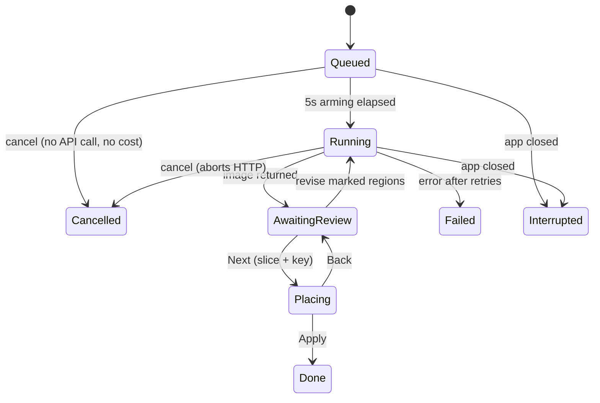

# Architecture

How the pieces fit together and how data moves through them. For project status,
conventions and open questions see [CONTEXT.md](CONTEXT.md).

## Layering

```
┌─────────────────────────────────────────────────────────────┐
│  Browser                                                     │
│    wwwroot/js/interop.js      ← ALL pixel work + FS Access   │
│           ▲ JSInterop (small payloads only)                  │
├───────────┼─────────────────────────────────────────────────┤
│  TextureStudio.App (Blazor WASM)                             │
│    Pages/*.razor              ← UI, no domain logic          │
│    Services/StudioState.cs    ← the single app state object  │
│    Services/ImageCodec.cs     ← typed wrapper over interop   │
│    Services/WorkspaceService  ← typed wrapper over FS Access │
├─────────────────────────────────────────────────────────────┤
│  TextureStudio.Core (pure, no UI, no JS)                     │
│    Formats/   VSWAP parsing, VGA palette, tile decoders      │
│    Imaging/   compose · slice · key · placement · darken     │
│    Generation/ model clients, revision tools                 │
│    Model/     Project + everything persisted                 │
└─────────────────────────────────────────────────────────────┘
        ▲                                   ▲
   TextureStudio.Pack                 TextureStudio.Rekey
   (workspace → mod dir)          (re-slice archived sheets)
```

Dependencies point inward only: Core knows nothing about Blazor, JS, or the
workspace. The two CLIs reuse Core directly, which is why pack/re-slice logic
never has to be duplicated for the browser.

## Process model and the interop boundary

The app runs on a **single WASM thread**. That one constraint shapes most of the
design:

- **Pixel work lives in JavaScript.** Composing a 2048² sheet, downscaling a
  preview, stroking annotation outlines, and building the approved-frames grid
  all happen on browser canvases. `ImageCodec` is the only caller, exposing
  `ComposeSheetAsync`, `ComposePngGridAsync`, `AnnotatePngAsync`,
  `PreviewDataUrlAsync`, `ToDataUrlAsync`, `DecodePngAsync`, `EncodePngAsync`,
  `PngSizeAsync`.
- **Only small payloads cross the boundary.** Composition sends 64px source tiles
  plus placement rectangles and gets back one PNG; it never marshals the canvas.
- **C# pixel work is deliberate and chunked.** Slicing, keying and placement
  restore are genuinely CPU-bound in Core, so they run one cell at a time with
  `await Task.Delay(1)` yields and a progress status, keeping the UI responsive
  and avoiding the browser's "page unresponsive" dialog.
- **Job PNG bytes are the source of truth; pixels are lazy.** A `GenerationJob`
  holds `RawPng` plus a cached preview data URL; `Sheet` (decoded `RgbaImage`) is
  materialized only when slicing or compositing needs it, then freed.

`interop.js` also hosts the non-image glue: `getRect` (measuring the rendered
canvas so region maths is exact at any size), `copyText`, `autoSizePrompt`,
`registerSelectAllHandler`, and the File System Access helpers `wsProbeWrite` /
`wsForget`.

## State management

There is no store, reducer or DI-scoped view models — one mutable object plus one
event:

```csharp
StudioState.OnChange += StateHasChanged;   // every pane subscribes
State.Notify();                            // fire + schedule a debounced save
```

`StudioState` owns the project, selection, jobs, URL caches, and the API keys. All
panes render from it and call `Notify()` after mutating it. `Notify()` both raises
`OnChange` and schedules the 1.5s debounced autosave, which is why *forgetting*
`@bind:after="State.Notify"` silently loses data (see CONTEXT.md).

Component-local state stays local: platter selection, drag targets, lightbox
index, placement focus and the placement zoom live in their `.razor` files, not in
`StudioState`.

### Image URL caches

Tiles are shown as data URLs, cached per key with a lane suffix so the same tile
can be displayed several ways without recomputation:

| Lane | Contents |
| --- | --- |
| `\|o` | original art |
| `\|r` | display art — honours the source/redraw toggle **and** applies dark derivation |
| `\|rr` | raw redraw, ignoring the display toggle |
| `\|ra` | redraw cropped to significant bounds + pad (zoom-to-art) |
| `\|da` | display art, zoom-to-art (items grid) |
| `\|oa` | original art, zoom-to-art |

The distinction matters: `|r` goes through `GetDisplay`, which returns *originals*
when "show redraws" is off and darkens AlternateDarks — so it must never feed a
reference preview. Reference strips use `|rr`/`|ra`. Suffix matching checks longer
suffixes first (`EndsWith("|r")` also matches `|rr`). The cache clears wholesale
past ~1600 entries and refills lazily for whatever is on screen.

## Persistence

Two tiers, both inside the user-chosen workspace folder:

- **`project.json`** — the entire logical project: items, per-tile meta, groups
  (including `SeamlessRuns`), per-tile version index, dark/lighten params,
  generation settings, job history, and UI state. Debounced-saved; flushed
  immediately when a settings drawer closes.
- **Files on disk** — anything large: `originals/`, `redraws/`,
  `revisions/<group>/<id>/`, `generations/` (every raw sheet verbatim),
  `jobs/<jobId>/` (keyed tiles of an in-progress placement session), refs, and
  the two API key files (never in `project.json`, so the project stays
  shareable).

`WorkspaceService` wraps the File System Access API (`PickAsync`, `RestoreAsync`,
`HasStoredHandleAsync`, `ProbeWriteAsync`, plus read/write/list). The directory
handle is remembered in IndexedDB, so a returning session silently reconnects when
permission persists. A write probe at connect time flags read-only handles rather
than failing later.

### Save/restore cycle

```
SaveProjectToWorkspaceAsync
  └─ SyncJobHistory()          rebuilds Project.JobHistory (newest 50)
                               + Project.Ui snapshot (group, tabs, filters…)
  └─ write project.json

LoadFromWorkspaceAsync
  └─ deserialize project.json
  └─ RestoreJobHistory()       rebuild live jobs; Queued/Running → Interrupted,
                               Placing keeps its placement snapshot
  └─ RestoreUiState()          reopen group, tabs, items filters, redraw toggle
  └─ migrations (items, versions, style prompt, seamless runs)
```

Migrations are idempotent and run on every load, which is how old projects keep
working across model changes (e.g. legacy whole-group `Seamless` → per-run
`SeamlessRuns`).

## Sheet layout

`SheetComposer.PlanLayoutRuns(keys, tilePx, gutterPx, seamlessRuns)` is the single
source of geometry — the platter preview, the composed PNG, and the slicer all
consume the same `SheetManifest`.

Rules: sheets are always **square**; ordinary cells get a gutter on every side;
seamless run members butt edge-to-edge (X advances by exactly `tilePx`) and never
wrap mid-run — if a run doesn't fit in the remaining row, the row ghost-fills and
the run starts fresh on the next one. After a run the cursor resumes at the next
*nominal* column, so the gutters it skipped accumulate as a visible gap at the
run's end. The grid side starts at `max(ceil√n, longest run)` and grows until all
rows fit.

`PlannedLayout` returns the manifest plus the empty ghost slots, so the platter
renders the true predicted sheet rather than an approximation.

## Prompt assembly

`BuildPrompt()` produces the text; `BuildSheetMapPrompt(manifest)` is appended at
job start (so the map matches the exact sheet being sent):

```
"Redraw this sprite sheet to be upscaled."
"Style Description: {user text}"
{SheetMechanicsPrompt}                       ← hidden, non-editable mechanics
Image 1 is the sprite sheet to redraw.
Image 2..n are style references — {per-ref context}
  + "use them as context only; do not copy their subject matter…"
Image n+1 is a character reference — appearance only, never composition
Image n+2 is a grid of already-approved frames — match their look
--- sheet map ---
grid geometry guard (never re-layout/enlarge/crop/re-frame)
(row,col) ItemName — Purpose  [small object] [variant frame: match cell (r,c)]
CRITICAL strip clauses for each seamless run
Items on this sheet: …
magenta-cell clause (inset, front-facing, matte discipline)
```

Attachment images are assembled in the same order by
`BuildGenerationImagesAsync`, so the indices in the text always line up with what
the model receives. Revisions use a leaner attachment set (annotated sheet +
style refs only).

## Job engine



- **Arming** — every run waits 5s before the API call, counting down in its toast,
  so a mistaken Generate costs nothing.
- **Batching** — the versions of one Generate share a `CancellationTokenSource`
  and run strictly in series; the input sheet is composed once up front because
  the active group can change while later versions wait.
- **Concurrency** — `WaitForJobSlotAsync` polls a counter against
  `MaxConcurrentJobs`, so the setting takes effect immediately for anything still
  waiting.
- **Retry** — `GenerateWithRetryAsync` backs off 5s/15s/45s on 429/5xx/
  `RESOURCE_EXHAUSTED`/`UNAVAILABLE`/HTTP timeout, and never retries a user
  cancellation. Provider error messages are formatted `"<Provider> API <code>: …"`
  precisely so this classifier can read them.
- **Surfacing** — jobs appear as bottom-right toasts and in the jobs popup; a tab
  opens only when the user clicks one. `OpenTabs` + `ActiveJob` model the tab
  strip, and both persist.

## Slice and key pipeline

`PrepareSliceAsync` (state `AwaitingReview` → `Placing`), per cell:

1. **Locate** — map the manifest rect onto the returned sheet, then refine with
   `DetectContentBox` (luminance vs. estimated background). Disagreement beyond
   8% falls back to the proportional rectangle. Seamless members keep exact
   proportional horizontal cuts, because butted neighbours have no gutter to
   detect.
2. **Erode** — detected sprite boxes trim 0.4% (1–6px) on all sides, discarding
   the antialiased blend against the sheet border that would otherwise survive as
   a dark hairline.
3. **Square** — walls resample to the target square exactly. Sprite crops with
   >2% aspect skew scale *aspect-true* and centre on a square canvas padded with
   magenta matte (or transparency for pre-keyed sheets), so characters are never
   squished.
4. **Key** — `AlphaKeyer.KeyAuto` picks a strategy: transparent corners → trust
   the alpha and just suppress fringe; magenta matte detected → `KeyOutMatte`
   (despill with a signed R−B gate so purple art survives, plus warm-glow unmix
   for painted glows); otherwise border-connected flood.
5. **Seed placement** — `SpriteFootprint.ComputePlacement` produces the auto
   fit (aspect-fit into the original's significant bounds), plus the anchor and
   bounds rect the alignment commands aim at.

Each keyed tile is also written to `jobs/<jobId>/` so the tuning session survives
a refresh.

## Placement tuning

`SlicePlacement` carries a live transform (`Scale`, `OffsetX`, `OffsetY`,
`Rotation`) over a ghost of the original. The preview is pure CSS
(`left/top/width/height` percentages plus `rotate()`), and drag deltas convert to
cell fractions using the known stage size — no DOM measuring in the hot path.

`SpriteFootprint.ApplyPlacement` bakes it: a fast path (`Array.Copy`) when
rotation is zero, inverse-mapped bilinear sampling when not. Rotation is
clockwise about the placed rect's centre, matching CSS, and there's a parity test
for exactly that. Alignment uses two different anchors deliberately: centring
pins the *significant-bounds centre*, edge alignment uses the rotation-carried
AABB.

Apply writes each included tile to `redraws/`, records a `TileVersionInfo`
(including its placement) so frames can be swapped between runs later, and adds a
group revision.

## Revisions

Up to four colour-labelled sets, each with regions and its own instruction.
`RevisionTools.Annotate` strokes coloured outlines onto a copy of the sheet
(browser-side), the model returns a revised sheet, and
`RevisionTools.CompositeRegions` blends **only the marked rectangles** back over
the original. Pointer maths measures the rendered canvas rect via `getRect`, so
region coordinates stay exact regardless of how the responsive preview is sized.

## Light/dark variants

- `DerivedDark` tiles have no art of their own: the packer darkens their light
  source's redraw with `DarkParams`.
- `AlternateDark` tiles have their own art: they darken *themselves*, and their
  `LightSourceKey` is only a brightness reference quoted in the prompt.
- Because models return noise when asked to paint dark variants, AlternateDark
  originals are **lightened** with `LightenParams` on the way *into* a sheet; the
  dark transform then re-darkens the redraw for display and packing.
- Both transforms are tuned in the Generation drawer against real pairs pulled
  from the loaded VSWAP, previewing the live transform beside the 1993 ground
  truth.

## Packing

`TextureStudio.Pack <workspace>` walks the project and writes
`<workspace>/pack/aog/{wall|sprite}_<id:08>.png`: redraws as-is, AlternateDark as
darken(own redraw), DerivedDark as darken(light source's redraw). Sprites keep
alpha; walls stay opaque. bstone's hardware renderer probes those paths inside any
VFS search path, so `bstone --mod_dir <workspace>/pack` plus the External Textures
option is the whole install story — no engine changes.

## UI composition

- **Shell** (`Home.razor`) — topbar (source/redraw segmented toggle, Settings
  menu), collapsible Items sidebar, optional Properties column, main pane,
  statusbar (workspace split button, busy ring, Jobs button with status pills),
  and the drawer host (Model API / Style / Generation / Application).
- **Main pane** (`GroupPane.razor`) — a tab strip whose first tab is always the
  group grid; each opened job gets a closable tab, fully decoupled from the group
  selection. Notification banners render at the top of this pane.
- **Group grid (platter)** — absolutely positioned from the layout manifest, so it
  is a true miniature of the sheet that will be sent. Joined runs render as a
  single flex strip; ghost cells show the remaining capacity.
- **Results views** — "Review & Revise" (revision sets, region marking) and
  "Adjust & Apply" (placement grid, per-frame controls, inline help).

## Extension points

- **Add a model provider** — implement a client in `Core/Generation`, register it
  in `Program.cs`, add a key property + workspace key file in `StudioState`,
  route it in `GenerateWithRetryAsync`, and extend `ThinkingLevelsFor` /
  `DefaultThinkingFor` so the Effort control filters correctly. Format API errors
  as `"<Provider> API <code>: <body>"` so retry classification keeps working.
- **Add a persisted setting** — put it on `GenerationSettings` (project-wide) or
  `UiState` (session/UI). If it goes on `UiState`, carry it through the
  `SyncJobHistory` rebuild or it will silently reset on the next save.
- **Add a prompt clause** — hidden mechanics belong in `SheetMechanicsPrompt` or
  `BuildSheetMapPrompt`, never in the user-editable style description.
- **Add pixel work** — if it touches more than a few tiles, put it in
  `interop.js` and expose it through `ImageCodec`; if it must be C#, chunk it
  with yields and a progress status.
